# xCross

[](https://github.com/Jalzn/xcross/actions/workflows/ci.yml)
[](LICENSE)
[](https://www.python.org/downloads/)

**xCross** is a calibrated *expected-cross* model that scores the quality of crosses in
football using broadcast tracking data. Instead of labelling a cross as success/failure,
it outputs a **calibrated probability** that, aggregated per player, lets you rank who
delivers the best crosses.

This repository is the **continuous development of the xCross method** — not a one-off
release. Each iteration is captured as a versioned paper in [`papers/`](papers/), while the
code, results and docs here always track the latest version. See [Evolution](#evolution)
for what changed across versions.

## Quickstart

The results are committed, so you can explore the model **without the licensed tracking data**.
After [installing with `uv`](#install):

- **Browse the results** — every figure and metric is under
  [`artifacts/reports/`](artifacts/reports/): the per-player ranking with names
  ([`ranking_final_success.csv`](artifacts/reports/metrics/ranking_final_success.csv)), the
  out-of-fold score of every cross
  ([`oof_predictions.csv`](artifacts/reports/metrics/oof_predictions.csv)), and the full model
  comparison ([`comparison.csv`](artifacts/reports/metrics/comparison.csv)).
- **Run a pretrained model** on your own feature rows → [Pretrained models](#pretrained-models).
- **Rebuild everything from raw tracking** — the only step that needs the PFF data →
  [Pipeline](#pipeline).

## Two models

- **xCross** — uses only the moment of the cross (start position, context). Measures the
  *quality of the situation created*.
- **xCrossOT** — adds the **ball's destination** (where it arrived). Measures the *danger
  of the delivery*.

Both are trained as the matrix `{xCross, xCrossOT} × {success, shot} × {XGBoost, AdaBoost,
CatBoost} × {isotonic, sigmoid}`, evaluated on out-of-fold probabilities with
`StratifiedGroupKFold` per match (the same match never appears in both train and test).
The final report selects the best model per target from the comparison table
([`comparison.csv`](artifacts/reports/metrics/comparison.csv), rendered as
[`table_comparison.png`](artifacts/reports/figures/table_comparison.png)) — it is not
hardcoded.

## How it works

Each cross is reduced to the **spatial configuration at the moment it is struck**. From the
players' positions and velocities (projected a moment ahead) we build per-cell maps over the
attacking half and summarise them over pitch regions into the model's features. Two maps
capture complementary ideas:

- **Positional entropy** — how spread out vs. clustered the players are (a proxy for how
  organised the box is).
- **Entropy difference (attack − defense)** — which side's shape dominates each area.
- **Pitch control** — which team is likely to reach each area first (territorial dominance).

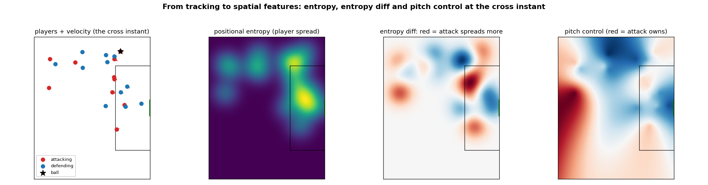

The same instant, four views: raw tracking → positional entropy → attack-minus-defense
entropy → pitch control. Entropy reads *where the players are*; pitch control reads *who
owns the space*. The feature modules in [`xcross/features/`](xcross/features) turn these maps
into the scalar inputs the models consume (see [`docs/metrics.md`](docs/metrics.md) for the
full feature list).

**Which features carry the signal?** The final models' importances confirm both maps matter,
and show *where* each acts:

| xCross (creation quality) | xCrossOT (delivery danger) |
|---|---|
| 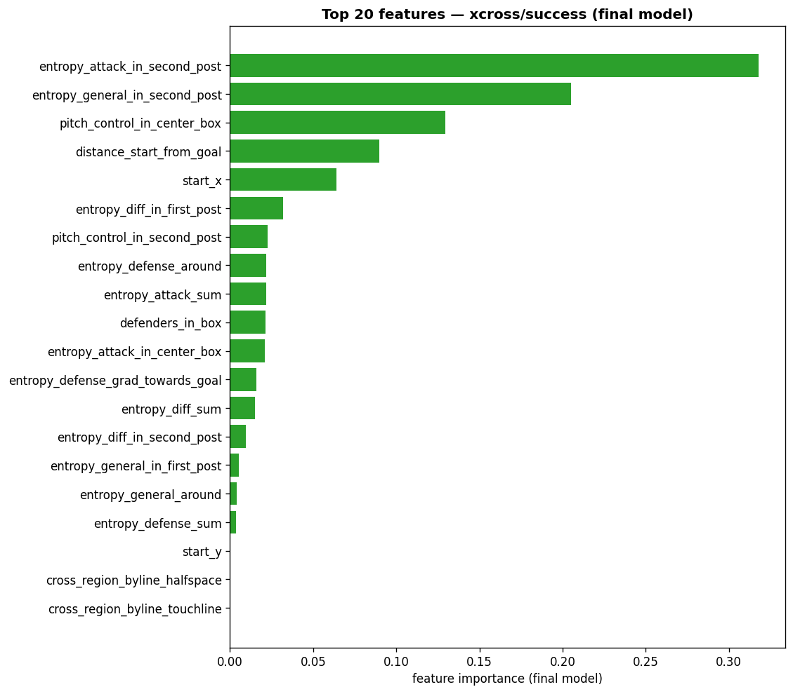 | 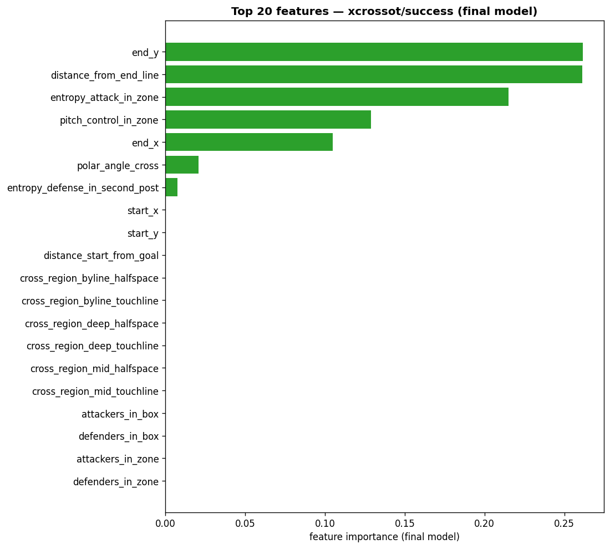 |

For **xCross**, attacking-shape entropy at the far post leads (`entropy_attack_in_second_post`,
`entropy_general_in_second_post`), then pitch control in the central box. For **xCrossOT** the
ball's arrival location dominates (`end_y`, `distance_from_end_line`), with arrival-zone entropy
(`entropy_attack_in_zone`) right behind — the same place the [entropy ablation](#evolution) shows
the gain concentrates.

## Results

> The figures below are produced by `uv run python -m xcross.model.report` and copied into
> [`docs/figures/`](docs/figures/) (see that folder's README). The full set and the meaning
> of every metric are documented in [`docs/metrics.md`](docs/metrics.md).

Everything below is measured on **≈7,500 crosses from 776 matches** across three leagues
(Brasileirão 2023, Premier League 2024–25, Bundesliga 2025–26), on out-of-fold probabilities.

**Final models** (AdaBoost selected for all four; full metric definitions in
[`docs/metrics.md`](docs/metrics.md)):

| Model | Target | AUC | ECE | Stability | ICC |
|---|---|---|---|---|---|
| xCross | `success` | 0.57 | 0.009 | **0.76** | 0.13 |
| xCross | `shot` | 0.57 | 0.007 | 0.68 | 0.12 |
| xCrossOT | `success` | **0.78** | 0.009 | 0.30 | 0.03 |
| xCrossOT | `shot` | 0.71 | 0.009 | 0.43 | 0.04 |

xCrossOT discriminates best (AUC up to 0.78) while xCross gives the more reproducible ranking
(stability 0.76 vs 0.30) — the core trade-off charted below.

**Are the probabilities calibrated?** Both models track the diagonal across the range and ECE
stays under 0.01 — the calibration that broke down above ~0.7 in v1 (see [Evolution](#evolution)):

| xCross | xCrossOT |
|---|---|
| 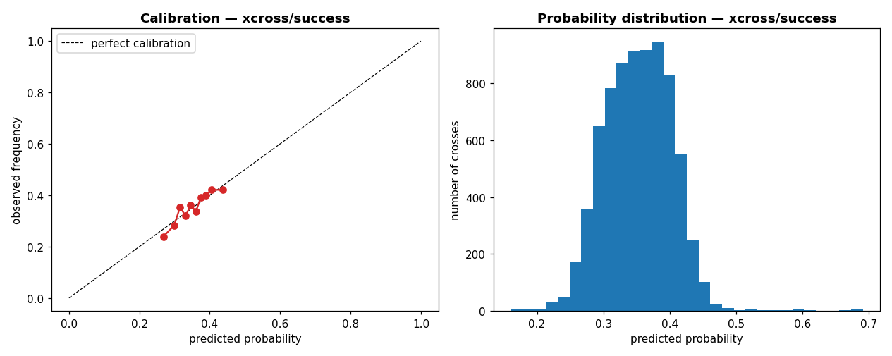 | 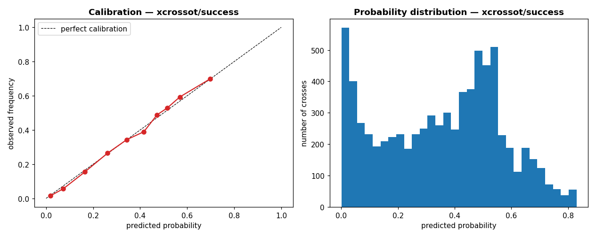 |

**And do they order crosses?** The complementary view — the actual success rate per
predicted-probability decile. The black line (mean predicted) hugging the bars re-confirms the
calibration above; the bars climbing left-to-right show the *ordering*. The gap between the two
models is the discrimination difference made visual: xCross lifts the success rate from ~24% to
~42% across deciles, xCrossOT from ~2% to ~70% (AUC 0.57 vs 0.78):

| xCross | xCrossOT |
|---|---|
| 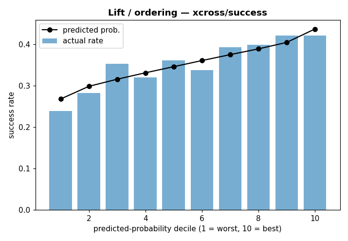 | 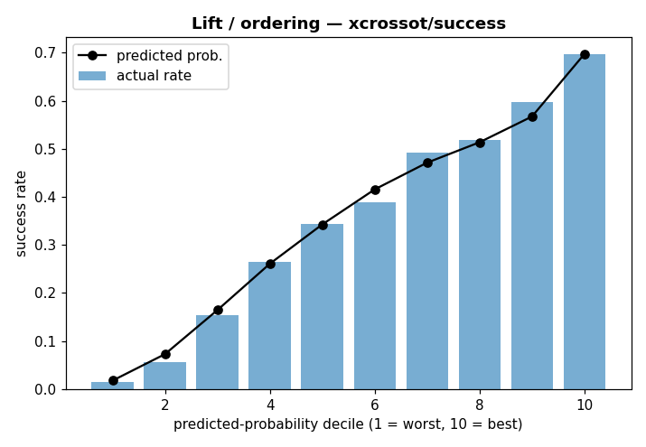 |

**Does it beat the raw cross-success rate?** Ranking players by their raw conversion rate
reproduces almost nothing; scoring the *situation* recovers a stable ranking that holds even
under the stricter chronological split:

| Ranking by | Stability (random halves) | Stability (temporal) | ICC |
|---|---|---|---|
| Raw success rate | 0.06 | 0.07 | 0.01 |
| **xCross** | **0.76** | **0.70** | **0.13** |
| xCrossOT | 0.30 | 0.21 | 0.03 |

**Player ranking by xCross (creation quality), with 95% CI** — left, crosses that end in a
successful shot (`success`); right, crosses that end in any shot (`shot`):

| `success` | `shot` |
|---|---|
| 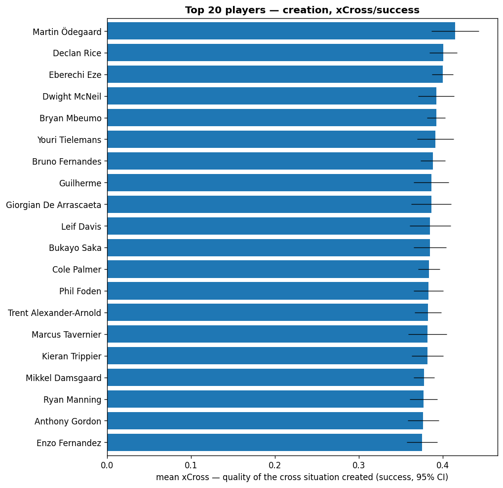 | 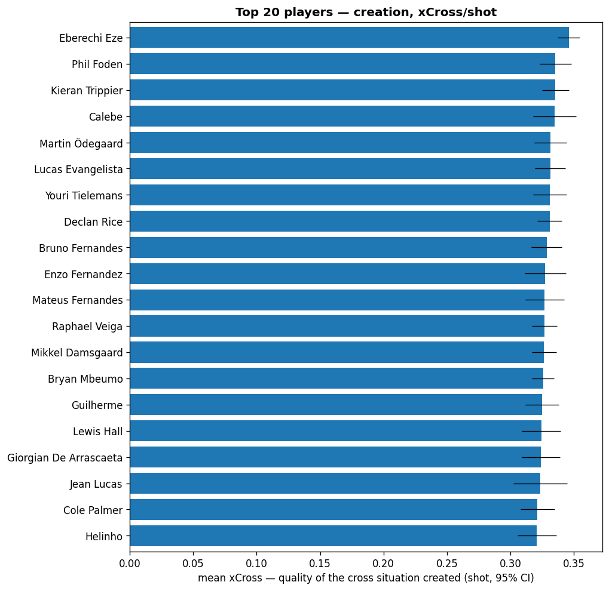 |

**Context vs. outcome — xCross × xCrossOT per player:**

| `success` | `shot` |
|---|---|
| 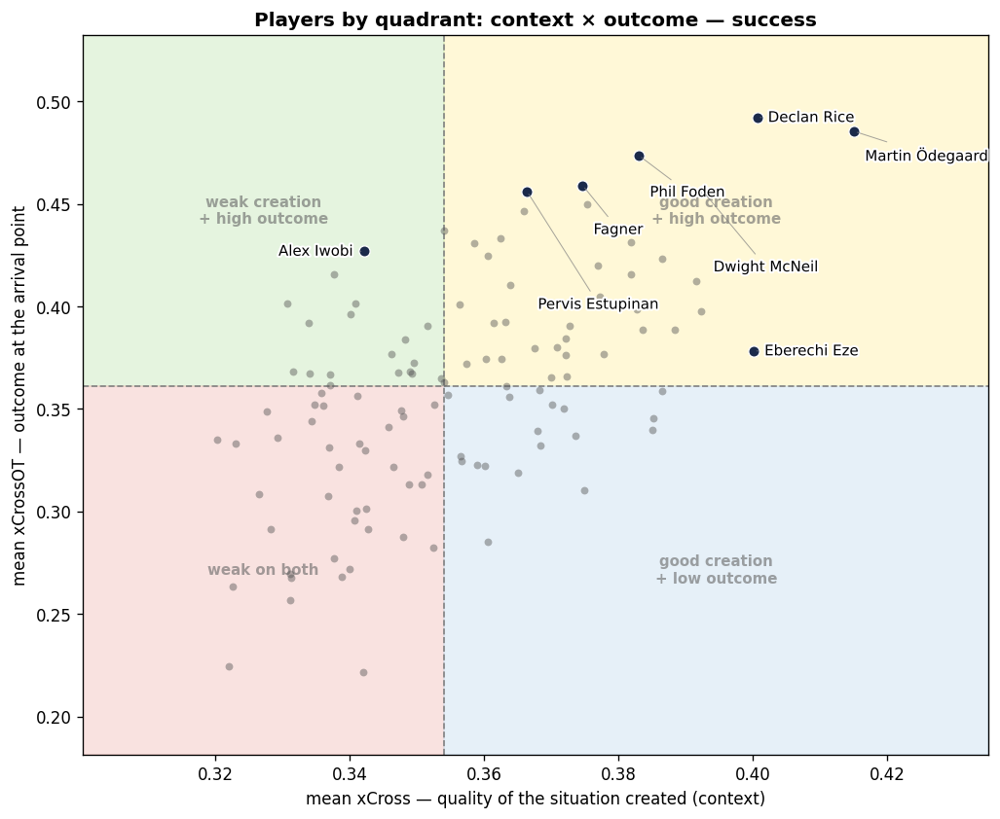 | 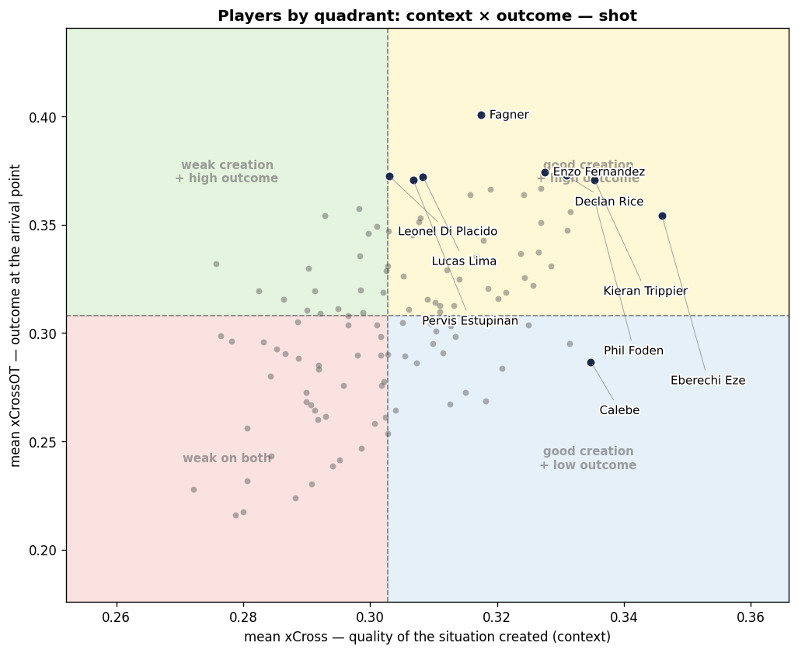 |

**The core trade-off — no model is both highly discriminative and highly reproducible:**

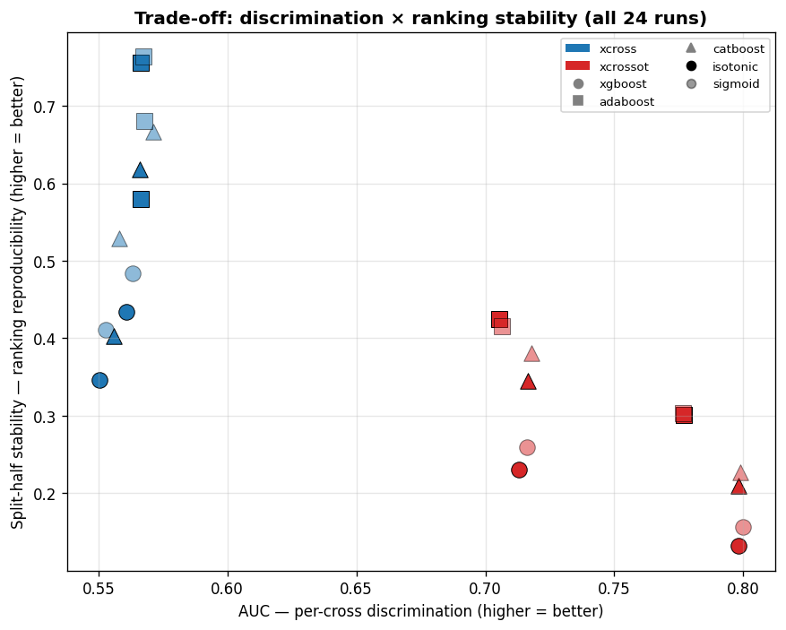

**Generalisation — does it hold across leagues and positions?** Metrics are stable
league-to-league (full seasons: Brasileirão, Premier League), and the per-position xCross
distribution behaves as expected — central midfielders and attacking mids score highest,
wingers and full-backs lower:

| By league | By position |
|---|---|
| 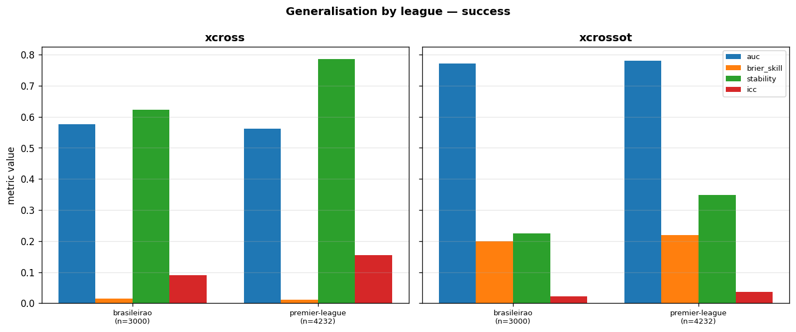 | 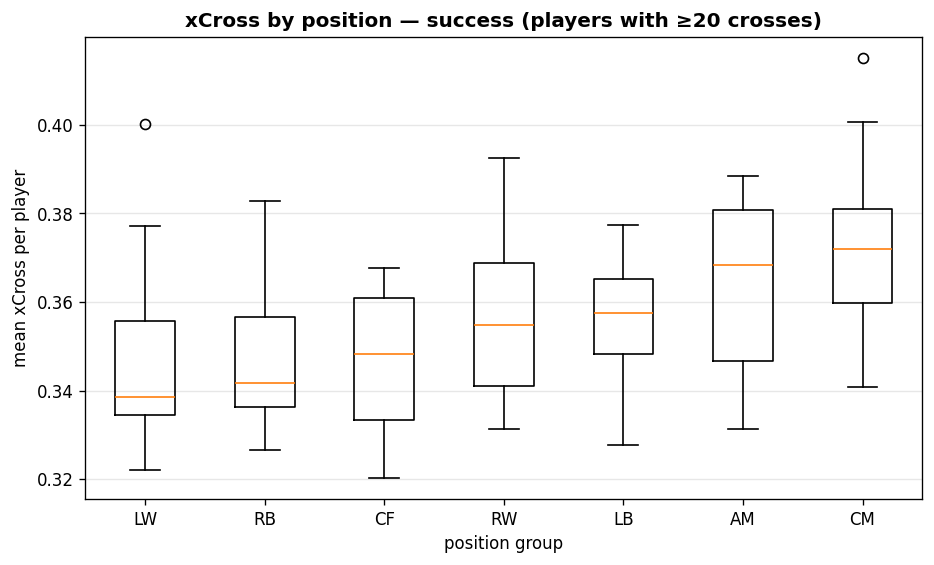 |

**How many players can we rank?** Stability climbs with sample size — ~0.62 at ≥10 crosses,
~0.83 at ≥50 — so the ranking uses a **≥20-cross** cut-off. That bar admits only ~13% of
crossers, though they account for ~50% of all crosses:

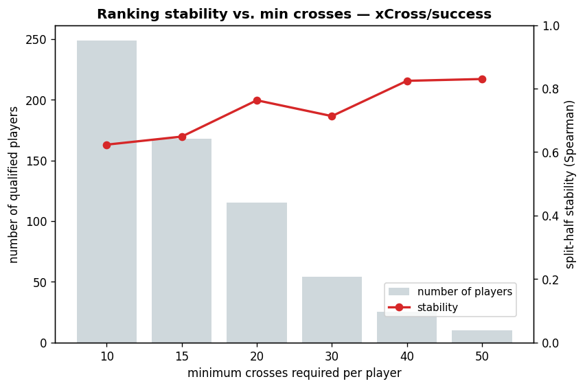

## Evolution

xCross is developed in the open, one version at a time. Each milestone is a versioned PDF in
[`papers/`](papers/); the full version-to-version comparison, with every number, lives in
[`docs/paper-comparison.md`](docs/paper-comparison.md).

**v1** — [`papers/xcross-v1.pdf`](papers/xcross-v1.pdf). The original method: the spatial
representation, the entropy and pitch-control features, xCrossOT > xCross, and the player archetypes.

**v2 (current)** — [`papers/xcross-v2.pdf`](papers/xcross-v2.pdf). Keeps v1's structure but fixes the
validation — **out-of-fold prediction grouped by match (no leakage)** and nested calibration — and adds
the reproducibility evidence v1 never reported. Headlines:

- **The model beats the raw stat.** Ranking players by their raw cross-success rate is *noise*
  (split-half stability 0.06); xCross recovers a **stable** ranking (0.76) that also **predicts future
  success ~3× better** than a player's own past success rate does.
- **Entropy helps but is not dominant.** Removing the entire entropy block (~half the features) costs
  only ~0.01–0.015 AUC; the gain concentrates in xCrossOT (arrival-zone entropy) — confirming v1's
  direction while tempering the weight it placed on entropy.
- **xCrossOT AUC rose** 0.74 → 0.78; **xCross fell** 0.62 → 0.57 (the match leakage the new validation
  removes). Calibration, which broke down above ~0.7 in v1, now holds across the range (ECE < 0.01).
- **Stated limits:** only 13% of crossers have the volume to be ranked (though 50% of all crosses), and
  the ranking is reproducible but its gradient is shallow.

| Ranking reproducibility — raw rate vs. the models | Entropy ablation — with vs. without |
|---|---|
| 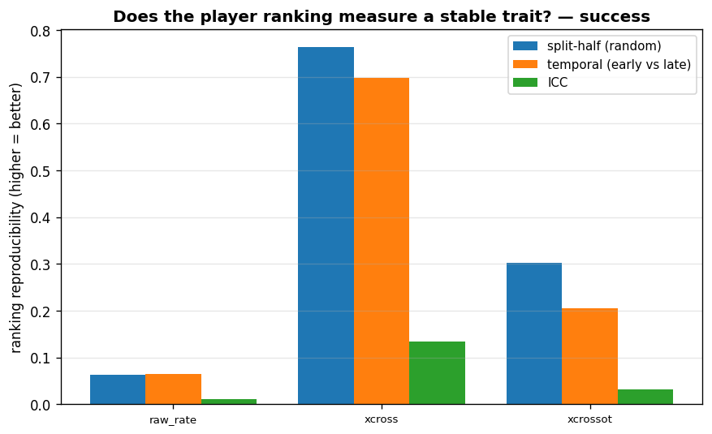 | 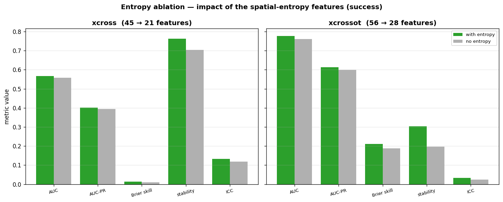 |

## Data

This project uses commercial broadcast-tracking data from **PFF FC** — it is **licensed, not
publicly downloadable, and not redistributed here**. You must obtain it yourself and place it
under `data/raw/` (the whole `data/` directory is git-ignored).

Expected layout, mirrored on both sides:

```
data/
  raw/        # PFF originals, read-only for the pipeline
    <league>/<season>/<match_id>/
      <match_id>.jsonl.bz2   # one JSON line per tracking frame (~25 fps)
      metadata.json          # teams, date, pitch dimensions, fps, attack side
      rosters.json           # line-ups: player_id, team_id, shirt number, position
  processed/  # parquet tables generated by the pipeline (regenerable)
  features/   # one row per kept cross, with all features (regenerable)
```

See [`docs/data.md`](docs/data.md) for the full description of each table.

## Install

This project uses [`uv`](https://docs.astral.sh/uv/).

```bash
uv sync          # create the environment from uv.lock
```

## Pipeline

Run the stages in order. Each stage is incremental: it hashes the relevant code + config
and skips matches whose outputs are already up to date.

```bash
# 1. raw PFF  ->  data/processed/  (5 parquet tables per match)
uv run python -m xcross.data.build

# 2. processed  ->  data/features/  (one row per cross, all features)
uv run python -m xcross.features.build

# 3. train the full matrix, write artifacts/reports/metrics/comparison.csv
uv run python -m xcross.model.compare

# 4. final report: pick the best model per target, write metrics, figures and
#    the player ranking to artifacts/reports/
uv run python -m xcross.model.report

# 5. serialize the headline model per target (calibrated) to artifacts/models/,
#    so it can be loaded for inference without the licensed data
uv run python -m xcross.model.export
```

Useful flags for stage 1:

```bash
uv run python -m xcross.data.build --leagues premier-league
uv run python -m xcross.data.build --matches 31995 --rebuild
```

## Pretrained models

The four headline models — `{xCross, xCrossOT} × {success, shot}` — are committed under
[`artifacts/models/`](artifacts/models/) as calibrated scikit-learn estimators (`joblib`),
each refit on all crosses with the exact `(estimator, calibration)` the report selected
(see [`model_metrics.csv`](artifacts/reports/metrics/model_metrics.csv)). They store only
split thresholds and leaf weights — **no tracking data is redistributed**.
[`metadata.json`](artifacts/models/metadata.json) lists, per model, the estimator, the
expected feature columns *in order*, and the library versions they were trained with (match
them with `uv sync` so the pickles load).

```python
import joblib, json

meta = json.load(open("artifacts/models/metadata.json"))["models"]["xcross_success"]
model = joblib.load("artifacts/models/xcross_success.joblib")

# `features` is one feature row per cross (run the feature pipeline on your own tracking
# data); select the expected columns, in the metadata order, before predicting.
prob = model.predict_proba(features.select(meta["feature_names"]).to_numpy())[:, 1]
```

To inspect scores **without** running anything, the committed
[`oof_predictions.csv`](artifacts/reports/metrics/oof_predictions.csv) already holds the
out-of-fold probability of every cross from all four models.

> **xCrossOT caveat.** xCrossOT's features describe the ball's destination and the
> configuration at the *end* of the cross window — information realised as the outcome is
> decided. Its higher AUC reflects that conditioning: read it as a *descriptive danger*
> score given where the ball arrived, **not** as a forward prediction from the moment of the
> cross. For prediction and the player ranking, use xCross.

## Project structure

```
xcross/
  config.py          # paths, pitch geometry, window and grid constants
  data/              # raw PFF -> processed parquet (extraction, IO, metadata)
  features/          # processed -> feature rows (spatial, grid, pitch control, ...)
  model/             # training (OOF + calibration), evaluation, comparison, report
docs/
  data.md            # data layout and how to obtain the PFF dataset
  metrics.md         # guide to every metric and figure the report produces
  paper-comparison.md # evolution log: what changed between versions
  figures/           # curated result figures used in this README
papers/              # the paper PDFs, one per version (xcross-v1.pdf, xcross-v2.pdf)
artifacts/reports/   # committed final results: figures (PNGs) and metrics (CSVs)
artifacts/models/    # committed serialized models (joblib) + metadata.json
tests/               # pytest suite
```

## Evaluation

The model is judged on three axes: calibration (are the probabilities correct?),
discrimination (do they separate crosses?) and stability (is the player ranking
reproducible?). Every metric and figure produced by the report is documented in
[`docs/metrics.md`](docs/metrics.md).

## Tests

```bash
uv run pytest -q
```

## Citation

If you use this model or code, please cite it (see [`CITATION.cff`](CITATION.cff)) and the
version you used — the PDFs in [`papers/`](papers/):

> Ferreira, J. *xCross: a calibrated expected-cross model from football tracking data.*
> https://github.com/Jalzn/xcross

## License

Code is released under the [MIT License](LICENSE). The PFF tracking data is **not** covered
by this license and is **not** included in this repository.
